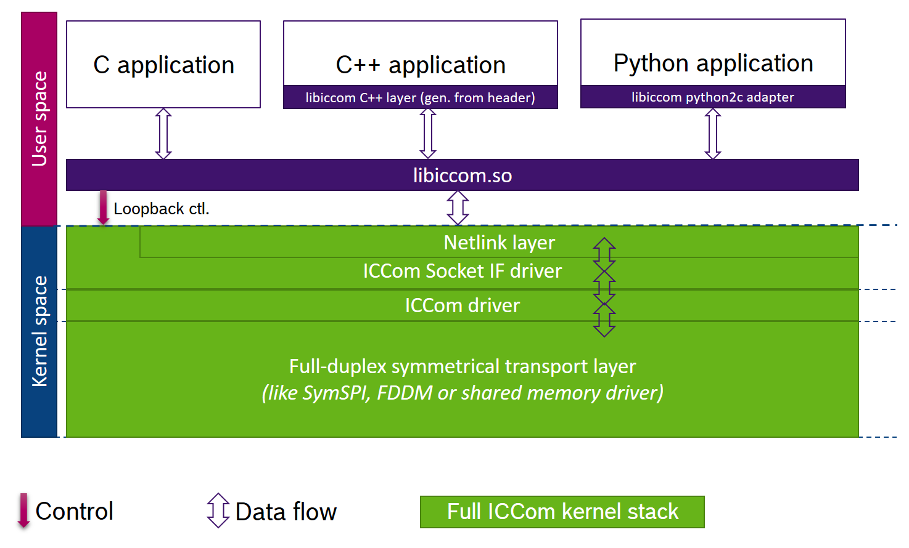
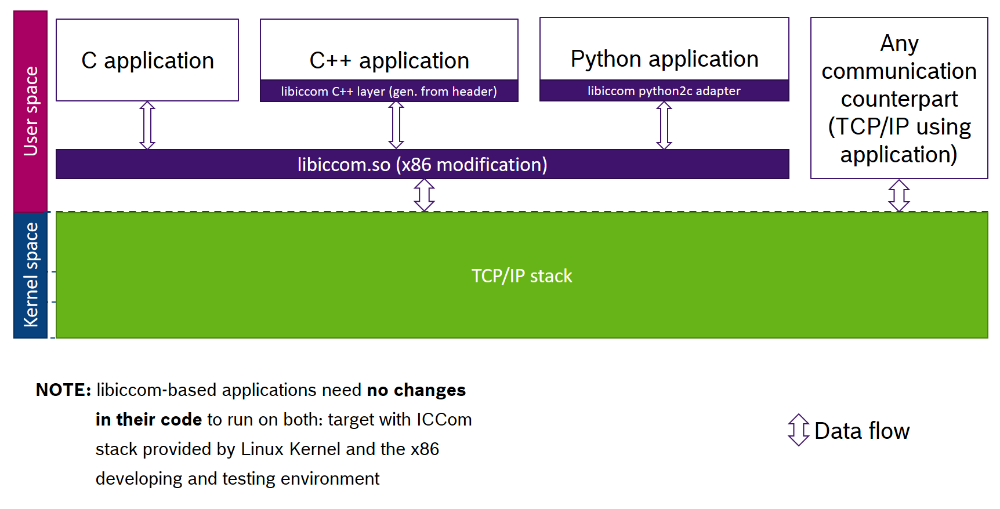

# [Libiccom](#libiccom)

## [Status](#status)

## [What is it?](#what-is-it)

The **convenience layer between the Linux Kernel ICCom stack and the
user land applications**. It provides a C, C++ and Python3 interfaces.

It **also provides the tcp network build configuration**, which allows one to
test and run the ICCom Stack applications on x86 platform.

In a bit detail now.

At its core it is just a wrapper on top of the `recvmsg(...)` and
`sendmsg(...)`.

* C language wrapper basically simply removes whole boilerplate about
  sending netlink messages and provides among others following functions:
  * `int iccom_open_socket(const unsigned int channel);` - to open an ICCom
     socket.
  * `void iccom_close_socket(const int sock_fd);` - to close the ICCom socket.
  * `int iccom_send_data(...)` - to send the given data.
  * `int iccom_receive_data(...)` - to receive the data from ICCom socket.

also send and receive calls have `_nocopy` versions which are to be used
when extra data copy for convenient usage is considered to be expensive.

Here is the location of **standard** libiccom in a system:



## [What is it for?](#what-is-it-for)

### Less boilerplate

It alows one to use the ICCom communication stack with a lot of boiler plate
removed. Instead of having fun with `recvmsg(...)` and `sendmsg(...)` one can
just use a code like this:

```c++
#include <cstdlib>
#include <cstdio>
#include <memory>

#include <iccom.h>

using namespace std;

#define SOCKET_READ_TIMOUT_MSEC 1000
#define EFAULT 1

// The application will listen to the channel 12345 forever and
// will send the first byte of any message received back into the
// same channel.
int main(int, char **)
{
    constexpr int MY_CHANNEL_NUMBER = 12345;

    IccomSocket sk {MY_CHANNEL_NUMBER};
    bool exiting = false;

    if (sk.open() < 0) {
        printf("Failed to open socket for channel %d, aborting", sk.channel());
        return -EFAULT;
    }

    if (sk.set_read_timeout(SOCKET_READ_TIMOUT_MSEC) < 0) {
        printf("Could not set the socket timeout, aborting");
        sk.close();
        return -EFAULT;
    }

    while (!exiting) {
        int res = sk.receive();

        // rcv error case
        if (res < 0) {
                printf("Receive on channel %d failed. Continuing.", sk.channel());
                continue;
        }

        // timeout case
        if (sk.input_size() < 1) {
                continue;
        }

        // getting first byte of received message data
        char my_data_one_byte = sk[0];

        // cleaning the output buffer of the socket
        sk.reset_output();

        // writing some data to the socket message buffer
        (*sk) << my_data_one_byte;

        // Sending the buffered output message into the channel.
        res = sk.send();
        if (res < 0) {
                printf("send on channel %d failed", sk.channel());
                continue;
        }
    }

    sk.close();

    return 0;
}
```

### x86 Simulation adapter

Second aim of the libiccom is to allow applications which use ICCom stack to
be run and tested on standard x86 machine.

To make this happen, one need only to build the libiccom in network
configuration mode using `-DICCOM_USE_NETWORK_SOCKETS=ON` option for
cmake, like this:

```shell
git clone LIBICCOM_REPO_PATH
mkdir -p build-libiccom
cd builds-libiccom
cmake ../libiccom -DICCOM_USE_NETWORK_SOCKETS=ON
make
sudo make install
```

This will build and install the libiccom which has exactly the same binary
IF as standard libiccom, but instead of using ICCom kernel stack for
communication, it uses the TCP/IP sockets.

**NOTE:** network libiccom modification still uses the netlink messages, only
    transport level is changed, so if one wants to write, say a Python
    mock-server to test target application, the Python code will receive
    a message over TCP/IP and this message will be in netlink format.

**NOTE:** the C application example above will work directly (without any
    modification) when linked against the x86 libiccom version.

So, the x86 simulation will look like that:



In such a way one will be able to run ICCom stack communication flow on
x86 machine while simulating the communication counterpart by TCP/IP
application on the same machine or any other machine in the network.

### ICCom stack (target modification) python3 wrapper for ICCom interface

This can be used to run mock tests on a target (when python application
mocks the communication counterpart using the ICCom loopback device).

Python3 running on target (with actual ICCom kernel stack available)
code snippet:

```python
import python3_libiccom as iccom

# enabling the loopback for a specific channel range
# with these parameters the ICCom channel 100 will have its remote
# end looped back to the channel 100 + 20000 = 2100.
first_ch_number, second_ch_number, loopback_offset = 100, 1000, 2000
iccom.loopback_enable(first_ch_number, second_ch_number, loopback_offset)

# binding to the remote end (loopbacked end) of the channel 100
fdescriptor = iccom.open(2100)

# send the data to the channel 100 (from remote end)
iccom.send(fdescriptor, bytearray(bytearray(b'\x00\x01\x02\x03\x04')))

# read the data from the channel 100 (from remote end)
rcv_bytearray = iccom.receive(fdescriptor)

# done, close the socket
iccom.close(fdescriptor)
```

So, using the code above, one can talk to the target application on the
target from the python script.

## [What problem it solves?](#what-problem-it-solves)

It solves three problems:
* unnecessary **wasting of developer time** for maintaining the netlink sockets
  interaction code and wrapping it up in something convenient,
* **inability to debug and test target (ICCom stack dedicated) applications
  fast**, cause they don't run on x86 platform without their code being
  changed,
* **wasting of developr time** for developing on-target loopback ICCom tests
  for applications (with libiccom test can be easily rapidly written in
  Python in minutes).

## [What it is NOT about?](#what-it-is-not-about)

It is not a framework, it is not a protocol, it is just a convenience wrapper
of standard Linux messaging routines and a layer which allows to abstract a
client application from actual communication software/hardware stack it runs
on.

Also, **it can be more efficient in terms of the speed** (say, writing
a message to IccomSocket class output buffer is currently implemented in
per-byte fasion, which is very far from optimal solution in terms of
resources).

Also, for now **it doesn't provide help in writing communication counterpart
programs for x86 environment**: one must implement them using existing TCP/IP
libraries and apps.

## [How to build it?](#howto-build-it)

Building is relatively straight forward. It does't use any non-out-out-the-box
dependencies. So, the **build&install libiccom in ICCom stack using
modification** will be the following:

```shell
git clone LIBICCOM_REPO_PATH
mkdir -p build-libiccom
cd builds-libiccom
# NOTE: this will build ICCom stack version
cmake ../libiccom
make
sudo make install
```

And correspondingly for **build&install libiccom for x86 platform + TCP/IP**:

```shell
git clone LIBICCOM_REPO_PATH
mkdir -p build-libiccom
cd builds-libiccom
# NOTE: this will build the TCP/IP x86 compatible version
cmake ../libiccom -DICCOM_USE_NETWORK_SOCKETS=ON
make
sudo make install
```

Also, to **build&install the python3 adapter**, run:

**NOTE:** you might need to see the second build snippet if your python
    version is not "3.7m"

```shell
git clone LIBICCOM_REPO_PATH
mkdir -p build-libiccom
cd builds-libiccom
cmake ../libiccom
make python_adapter
sudo cmake -DCOMPONENT=python_adapter -P ./cmake_install.cmake
```

for **alternative Python3 minor version** use:

```shell
git clone LIBICCOM_REPO_PATH
mkdir -p build-libiccom
cd builds-libiccom
cmake ../libiccom -DICCOM_PYTHON_ADAPTER_PYTHON_MINOR_VER=6
make python_adapter
sudo cmake -DCOMPONENT=python_adapter -P ./cmake_install.cmake
```

## [License](#license)

> Mozilla Public License Version 2.0
> SEE: LICENSE.txt
